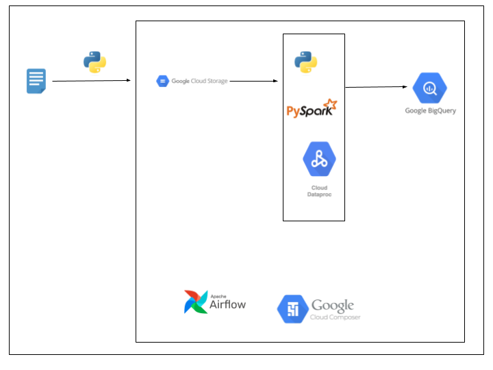
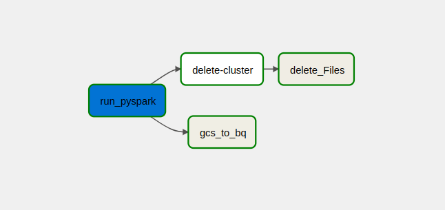

<h2>Eurovision Data Pipeline using GCP</h2>

This is an implementation of an end-to-end batch data pipeline that runs daily. It ingests the historical data of the Eurovision song competition, 
loads that data to Google BigQuery and finally produces insights via a dashboard.

The pipeline was built using **Python, Pyspark, Airflow, BigQuery API, Google Dataproc, and Google Data Composer.**

<h2>How it works?</h2>

- Eurovision song data from Kaggle is ingested into the GCS bucket using Python.
- Data is then transformed to perform data cleaning operations using Pyspark on the Dataproc cluster.
- The transformed data is then loaded into a Bigquery table for analysis.
- The whole pipeline is orchestrated using Airflow which runs on the Google Composer environment. When data is loaded to the Bigquery  Dataproc cluster and all intermediate files will be deleted to save cost.
  

<h2>Architectural Diagram</h2>

<h2>Results</h2>

