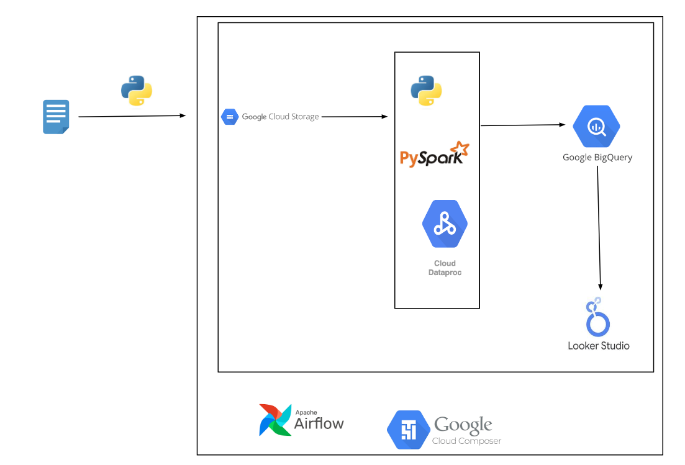

<h2>Batch Data Pipeline on GCP</h2>

This is an implementation of an end-to-end batch data pipeline which runs daily. It ingests the historical data of eurovision song competition, 
loads that data to Google BigQuery and finally produces insights via a dashboard.

The pipeline was built using **Python, Pyspark, Airflow, BigQuery API, Google Dataproc, Google Data Composer.**

<h2>How it works</h2>

- Eurovision songs data from kaggle is ingested to GCS bucket using python.
- Data is then transformed to perform data cleaning operations using pyspark on Dataproc cluster.
- The transformed data is then loaded to Bigquery table for analysis.
- The whole pipeline is orchestrated using Airflow which runs on Google Composer environment.

<h2>Architectural Diagram</h2>

<h2>Results</h2>
